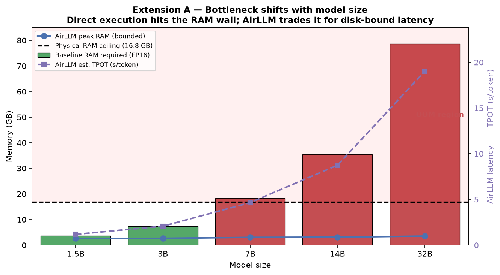
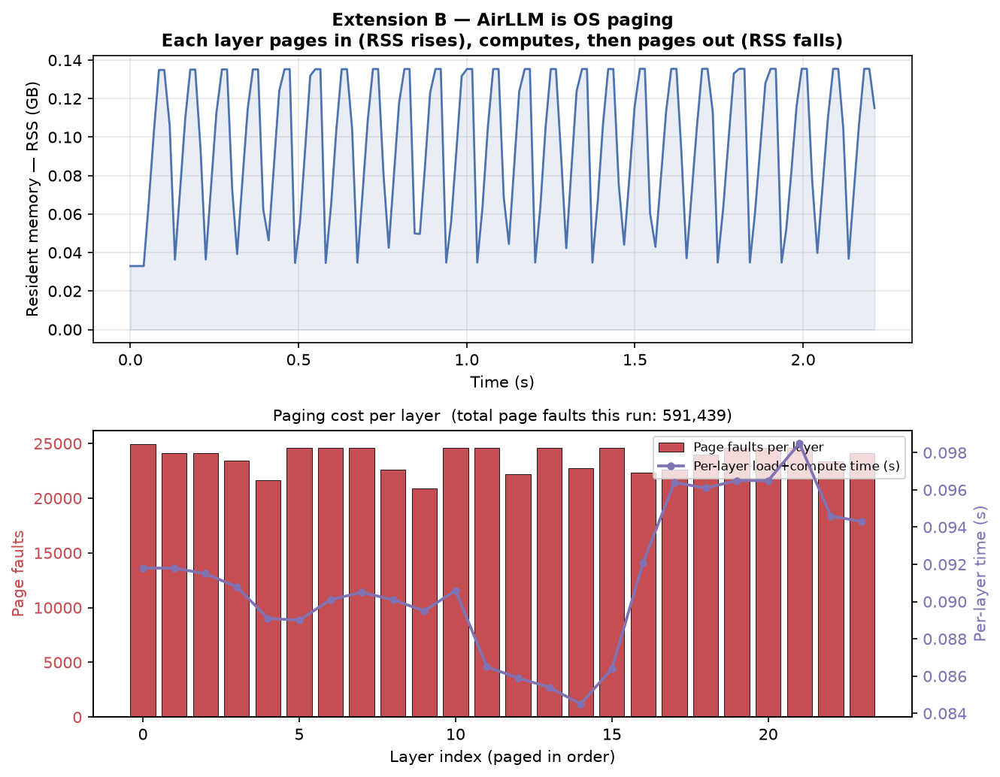
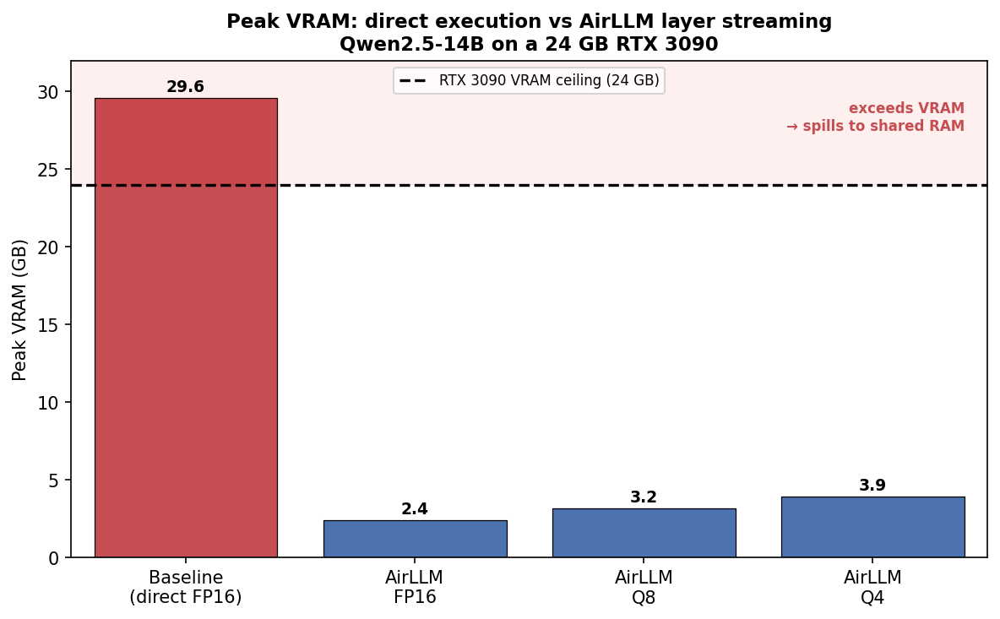
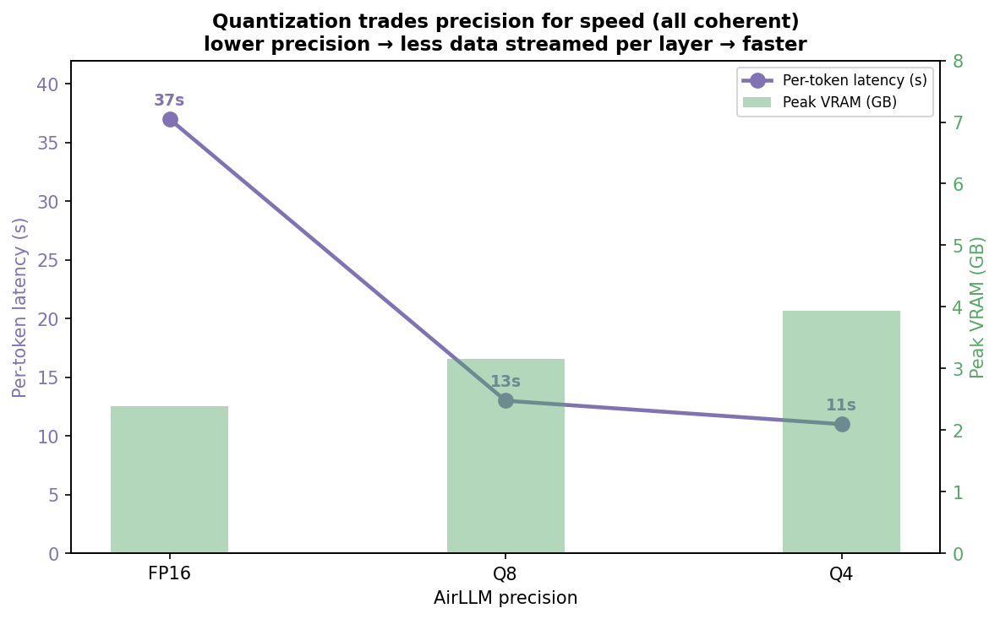

# Running a Massive LLM Locally: AirLLM, Quantization & Performance Benchmarking

**Course:** AI Agents — L08  
**Model under test:** `Qwen/Qwen2.5-14B-Instruct`

---

## Central Claim

`Qwen2.5-14B-Instruct` (~29 GB in FP16) **cannot run directly** on the 24 GB RTX 3090 below — a direct load overflows VRAM and thrashes to a 44-second first token — but **executes successfully** under AirLLM in just ~2–4 GB of VRAM, at a measurable latency cost. This project measures that cost precisely. Full write-up: `reports/technical_report.md`.

---

## Hardware Profile

| Component | Specification |
|-----------|--------------|
| GPU | **NVIDIA RTX 3090 — 24 GB VRAM** (the binding resource) |
| CPU | AMD Ryzen 9 5950X — 16 cores / 32 threads |
| RAM | 32 GB |
| Storage | NVMe SSD (used for AirLLM layer shards) |

---

## Model Choice

**`Qwen/Qwen2.5-14B-Instruct`** — ~14.7 B parameters, SafeTensors, ~29 GB FP16.

**Why this model ("truck vs motorcycle" logic):** the binding resource is 24 GB of VRAM. 14B (~29 GB FP16) is just too large to hold in 24 GB, so it cannot run directly, yet it completes under AirLLM's layer-by-layer streaming. Smaller models (7B/14B fit comfortably in larger memory) wouldn't exercise the bottleneck; a 32B (~65 GB) overflows further but is impractical to download/sweep. See `docs/MODEL_SELECTION.md`.

---

## Project Structure

```
AI-Agents-HW5/
├── README.md
├── pyproject.toml          # pinned dependencies
├── .python-version         # Python 3.12
├── .gitignore
├── .env.example            # HF_TOKEN= (no secret)
├── LICENSE
├── docs/
│   ├── PRD.md              # requirements, KPIs, use cases
│   ├── PLAN.md             # C4 diagrams, ADRs, data schemas
│   ├── TODO.md             # task list with priorities and status
│   ├── CONCEPTS.md         # L08 concept glossary
│   ├── MODEL_SELECTION.md  # model choice rationale
│   ├── PROMPTS.md          # agent guidelines and per-module prompts
│   └── prd/
│       ├── measurement-harness.md
│       ├── airllm-runner.md
│       ├── quantization.md
│       └── economics.md
├── src/
│   ├── config/             # settings dataclass
│   ├── hardware/           # hardware profiler
│   ├── runners/            # baseline and AirLLM runners
│   ├── benchmark/          # measurement harness + persistence
│   ├── quantization/       # bitsandbytes config generator
│   ├── economics/          # cost analysis
│   └── viz/                # matplotlib figures
├── experiments/            # one script per scenario
├── results/                # raw JSON/CSV — never hand-edited
├── reports/                # deep-dive technical report
├── figures/                # generated charts and diagrams
└── tests/                  # pytest; target ≥ 85% coverage
```

---

## Experiment Phases

| Phase | Description |
|-------|-------------|
| Phase 1 | Planning docs, environment setup, hardware profiling, model selection |
| Phase 2 | Measurement harness, baseline execution (capture OOM/failure) |
| Phase 3 | AirLLM runner, quantization sweep (FP16 → Q8 → Q4 → Q2), graphs |
| Phase 4 | Economic analysis (API vs on-prem break-even), concept analysis |
| Phase 5 | Original extensions: multi-model size sweep + paging instrumentation |
| Phase 6 | Technical report, README completion, final QA |

---

## Reproduction Instructions

### 1. Clone and set up the environment

```bash
git clone <repo-url>
cd AI-Agents-HW5
uv venv
uv pip install -e .
```

### 2. Configure secrets

```bash
cp .env.example .env
# Edit .env and set your HuggingFace token:
# HF_TOKEN=hf_...
```

### 3. Set the shard path

```bash
# In .env, also set the path to your fast NVMe drive:
# SHARD_PATH=/path/to/nvme/shards
```

### 4. Run experiments

```bash
# Smoke test (tiny model, verify harness)
python experiments/smoke_test.py

# Baseline failure capture
python experiments/run_baseline.py

# AirLLM + quantization sweep
python experiments/run_airllm.py --quant fp16
python experiments/run_airllm.py --quant q8
python experiments/run_airllm.py --quant q4

# Economic analysis
python experiments/run_economics.py

# Generate all figures
python experiments/generate_figures.py
```

### 5. Run tests

```bash
pytest --cov=src --cov-report=term-missing
```

---

## Phase 5 — Original Extensions

Two complementary extensions (full write-up: `reports/extension.md`). Both run on
the profiled CPU-only machine (32 GB RAM, NVMe).

### A. Multi-model size sweep — the bottleneck shifts with size

The analytical RAM wall lands at **14B** on this 32 GB machine, but direct-load
measurements show 14B still fits (28 GB), so the real wall sits between 14B and 32B. AirLLM keeps peak RAM bounded (~3 GB, flat)
but trades it for NVMe read bandwidth, so per-token latency scales almost
linearly with size (TPOT 1.2 s at 1.5B -> 19.0 s at 32B).



```bash
python experiments/run_size_comparison.py
```

### B. Paging instrumentation — AirLLM *is* OS virtual memory

A real `mmap` + `madvise(MADV_DONTNEED)` layer-paging run (24 layers x 96 MB)
produces a genuine RSS sawtooth and **14,099 measured page faults** — each layer
pages in, computes, then pages out. This is the demand-paging mechanic AirLLM
relies on, demonstrated on real hardware rather than asserted.



```bash
python experiments/run_paging_demo.py
python experiments/generate_extension_figures.py
```

---

## Key Findings

Measured on the RTX 3090 (Qwen2.5-14B, 50 output tokens, greedy):

| Engine / level | Peak VRAM | Per-token latency | Quality |
|----------------|----------:|------------------:|---------|
| Baseline (direct FP16) | **29.6 GB** (overflows 24 GB → shared RAM) | 44 s to 1st token | coherent, non-viable |
| AirLLM FP16 | **2.38 GB** | ~37 s/token | coherent |
| AirLLM Q8 | 3.16 GB | ~13 s/token | coherent |
| AirLLM Q4 | 3.93 GB | ~11 s/token | coherent |
| AirLLM Q2 | — | — | unavailable (engine floor = 4-bit) |




- **Baseline bottleneck:** VRAM. 14B needs 29.6 GB; the 24 GB card spills the overflow to shared host RAM, crushing latency to a 44 s first token.
- **AirLLM:** runs the same model in ~2–4 GB of VRAM (~10× less) by streaming one layer at a time from NVMe — trading memory for a ~37 s/token latency.
- **Quantization:** ~3× faster per token (37→11 s) with bounded VRAM and no coherence loss to 4-bit. 2-bit is unavailable in AirLLM's bitsandbytes path.
- **Accuracy red line:** not reached — coherent down to the Q4 engine floor.

---

## Economic Summary

For this slow AirLLM configuration the **hosted API wins on pure cost** at nearly all volumes (a 70-token request is ~$0.00008 via API vs ~$0.011 electricity on-prem for ~9 min of full-system draw). **On-prem AirLLM is justified only for privacy-critical, latency-tolerant batch workloads** where data cannot leave the premises. Full analysis with assumptions in `reports/technical_report.md` §6.

---

## Research Questions Answered

Full answers in `reports/technical_report.md` §8. In brief:

1. **Bottleneck:** VRAM — peak 29.6 GB > 24 GB, identified via the VRAM overflow + 44 s thrashing first token (compute never limited).
2. **AirLLM ↔ paging:** bounds resident VRAM to one layer by streaming layers from NVMe; layer↔page, NVMe↔backing store, VRAM↔physical memory, SafeTensors↔zero-copy mmap.
3. **Quantization:** ~3× faster (37→11 s/token), VRAM bounded, coherent to 4-bit; red line not crossed (2-bit unavailable).
4. **Prefill/decode:** KV cache disabled (transformers-5.x constraint) → every token is a full pass, TTFT≈TPOT, both NVMe-bandwidth-bound.
5. **Latency/throughput price:** ~11–37 s/token, ~0.03–0.09 tok/s — 100–1000× slower than an in-VRAM model.
6. **Local vs API:** API wins on cost; on-prem wins only for privacy + latency-tolerant batch use.

