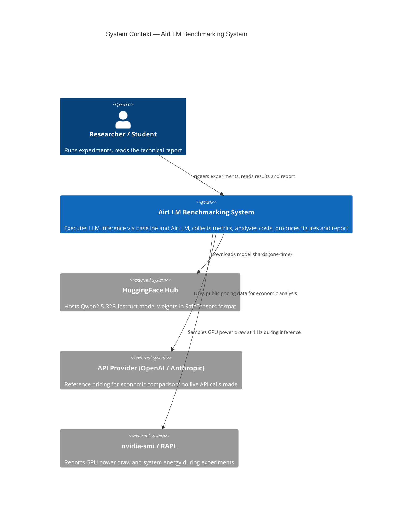
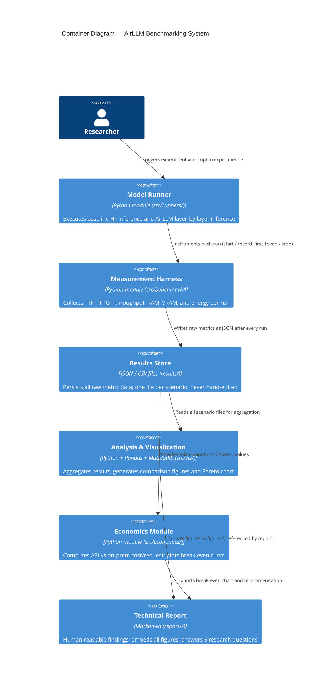
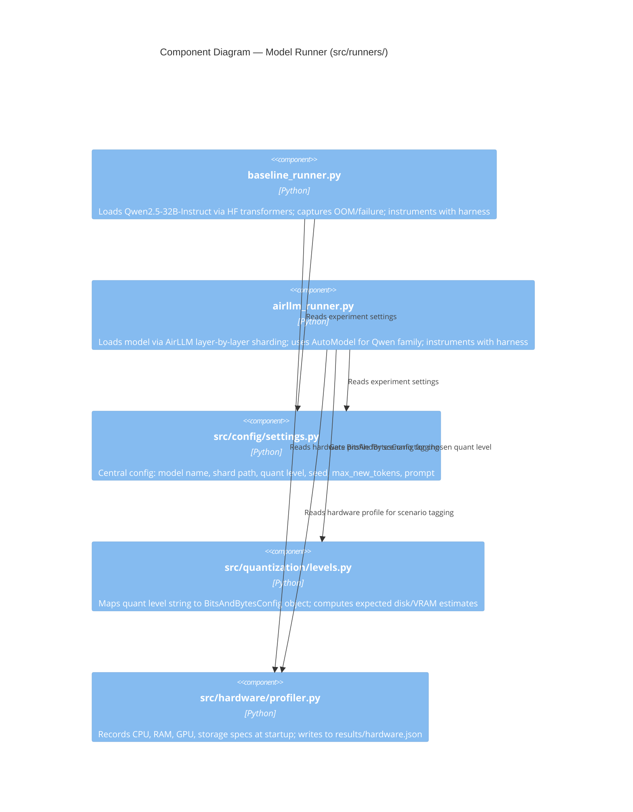
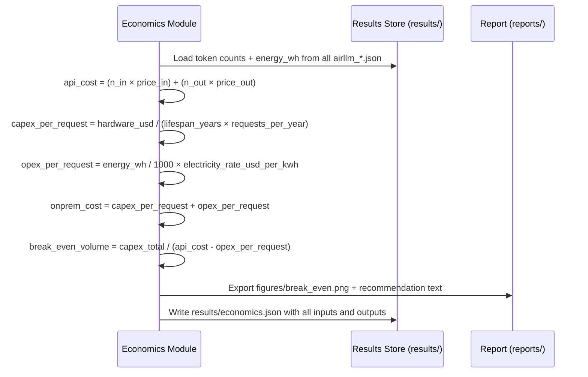
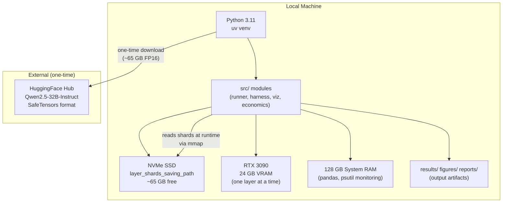

# Architecture Plan (PLAN.md)

## 1. C4 Model

### Level 1 — System Context



### Level 2 — Container Diagram



### Level 3 — Component Diagram (Runner Container)



### Level 4 — Code (Key Interfaces)

See **Section 4: API and Interface Documentation** and **Section 5: Data Schemas** below.

---

## 2. UML Diagrams

### Sequence Diagram — AirLLM Inference Run

```mermaid
sequenceDiagram
    participant R as Researcher
    participant Cfg as Config / settings.py
    participant Run as airllm_runner.py
    participant H as Harness (benchmark/)
    participant FS as FileSystem (NVMe shards + results/)
    participant HF as HuggingFace Hub

    R->>Cfg: Set model, quant_level, seed, max_new_tokens, prompt
    R->>Run: run_experiment()
    Run->>HF: Download / use cached SafeTensors shards (one-time)
    Run->>H: harness.start()
    H-->>H: Record t0; begin RAM + VRAM + power sampling threads
    loop Layer-by-layer forward pass (N transformer layers)
        Run->>FS: mmap-load shard i from NVMe
        Run->>Run: forward() through layer i on GPU
        alt First output token
            Run->>H: harness.record_first_token()
            H-->>H: ttft = now() - t0
        end
        Run->>FS: Offload layer i; free VRAM
    end
    Run->>H: harness.stop(n_output_tokens)
    H-->>H: Compute TPOT, throughput, peak RAM/VRAM, energy_wh
    H->>FS: Write results/airllm_<quant>.json
    Run->>R: Return generated_text + metric summary
```

### Sequence Diagram — Economic Analysis



### Deployment Diagram



---

## 3. Architectural Decision Records (ADRs)

### ADR-001: AirLLM over Direct HF Loading for the Oversized Model

**Status:** Accepted  
**Context:** `Qwen2.5-32B-Instruct` at FP16 requires ~65 GB of memory. The RTX 3090 has 24 GB VRAM. Direct loading exhausts VRAM and triggers OOM. The assignment (L08) explicitly requires demonstrating AirLLM's layer-by-layer offloading mechanism.  
**Decision:** Use AirLLM to split the model into per-layer SafeTensors shards and load one layer at a time, keeping peak VRAM within the 24 GB limit.  
**Alternatives considered:**
- *Ollama with GGUF*: Does GPU offloading but is GGUF-centric; less transparent for Python harness instrumentation.
- *DeepSpeed ZeRO-Infinity*: Designed for multi-GPU training with NVMe offloading; significantly more complex for single-GPU inference.
- *llama.cpp with GGUF*: Excellent for CPU inference; harder to integrate with a Python measurement harness.
- *HF `device_map="auto"` with disk offload*: Supported but less fine-grained than AirLLM's explicit per-layer sharding.

**Trade-offs:** AirLLM introduces very high disk I/O per token (every token decode reads all N layers from NVMe); TPOT will be orders of magnitude higher than native GPU inference. This is expected and the point of the experiment.  
**Rationale:** AirLLM is the mechanism demonstrated in L08 and required by the assignment; it also maps cleanly to OS virtual memory / paging concepts for concept analysis.

---

### ADR-002: SafeTensors over GGUF Format

**Status:** Accepted  
**Context:** Both SafeTensors and GGUF are common serialization formats for LLM weights.  
**Decision:** Use SafeTensors (the HuggingFace default for `Qwen2.5-32B-Instruct`).  
**Alternatives considered:**
- *GGUF*: Zero-copy mmap supported; highly optimized for llama.cpp; but not natively supported by AirLLM's Python-side layer sharding mechanism.

**Trade-offs:** SafeTensors uses a flat binary buffer enabling zero-copy `mmap`, which is exactly what AirLLM exploits for fast layer loads. GGUF may perform better under llama.cpp but that is not the target mechanism.  
**Rationale:** SafeTensors is the format the assignment targets and what AirLLM natively supports; it also allows the mmap/page-fault analogy for concept analysis.

---

### ADR-003: uv for Environment Management

**Status:** Accepted  
**Context:** Need a reproducible, fast Python environment with pinned dependencies.  
**Decision:** Use `uv venv` + `uv pip install`; pin all versions in `pyproject.toml`.  
**Alternatives considered:**
- *pip + venv*: Slower; no built-in lock-file guarantees.
- *conda*: Heavier; more complex for CUDA + torch combinations.

**Rationale:** `uv` is significantly faster than pip and produces a lockable environment; the assignment plan explicitly recommends it (§1.11).

---

### ADR-004: Qwen2.5-32B-Instruct as the Model Under Test

**Status:** Accepted  
**Context:** Must choose a model "too large" for direct GPU loading but feasible under AirLLM on the target hardware.  
**Decision:** `Qwen2.5-32B-Instruct` (32B parameters, ~65 GB FP16, SafeTensors on HuggingFace).  
**Alternatives considered:**
- *Llama-3-70B*: Larger; very long per-token times under AirLLM on 24 GB VRAM; less practical.
- *Mistral-7B*: Too small — fits on the GPU natively; does not exercise the bottleneck.
- *Qwen2.5-14B*: May partially fit on GPU; less dramatic bottleneck demonstration.

**Trade-offs:** 32B is large enough to OOM on direct load but small enough that AirLLM shards remain manageable in a reasonable timeframe.  
**Rationale:** Qwen-family is explicitly called out in L08 and the assignment plan. The `AutoModel` workaround for class-mismatch errors is documented in the plan (§6.1). 32B sits in the "truck vs motorcycle" sweet spot: biggest isn't automatically best.

---

## 4. API and Interface Documentation

### Runner Interface

Both `baseline_runner.py` and `airllm_runner.py` expose the same callable:

```python
def run_experiment(
    prompt: str,
    max_new_tokens: int,
    seed: int,
    quant_level: str,        # "fp16" | "q8" | "q4" | "q2"
    shard_path: str | None,  # AirLLM only; None for baseline
) -> ExperimentResult:
    """Execute inference and return generated text + metrics."""
```

`ExperimentResult` is a dataclass matching the result JSON schema (see Section 5).

### Harness Interface

```python
class Harness:
    def start(self) -> None:
        """Record t0; start background RAM, VRAM, and power sampling threads."""

    def record_first_token(self) -> None:
        """Called immediately when the first output token is emitted. Records TTFT."""

    def stop(self, n_output_tokens: int) -> Metrics:
        """Stop sampling; compute and return all metrics."""
```

### Quantization Interface

```python
def get_bnb_config(quant_level: str) -> BitsAndBytesConfig | None:
    """Return a BitsAndBytesConfig for the given level, or None for FP16."""

def estimate_disk_gb(quant_level: str, param_billions: float) -> float:
    """Estimate on-disk shard size in GB before downloading."""

def estimate_vram_gb(quant_level: str, param_billions: float) -> float:
    """Estimate peak VRAM for one layer in GB."""
```

### Economics Interface

```python
def compute_costs(
    n_input_tokens: int,
    n_output_tokens: int,
    energy_wh: float,
    api_price_in: float,
    api_price_out: float,
    hardware_cost_usd: float,
    lifespan_years: float,
    monthly_volume: int,
    electricity_rate_usd_per_kwh: float,
) -> EconomicsResult:
    """Compute cost/request for API and on-prem; derive break-even volume."""
```

---

## 5. Data Schemas

### Experiment Result Record (`results/<scenario>.json`)

```json
{
  "scenario": {
    "engine": "airllm",
    "model": "Qwen/Qwen2.5-32B-Instruct",
    "quant_level": "q4",
    "prompt_tokens": 42,
    "max_new_tokens": 200,
    "seed": 42
  },
  "metrics": {
    "ttft_ms": 12500.0,
    "tpot_ms": 8300.0,
    "throughput_tokens_per_sec": 0.12,
    "peak_ram_gb": 48.3,
    "peak_vram_gb": 9.1,
    "wall_clock_sec": 1680.0,
    "energy_wh": 0.42
  },
  "output": {
    "generated_text": "...",
    "n_output_tokens": 200,
    "quality_note": "coherent"
  },
  "timestamp": "2026-06-21T14:00:00Z"
}
```

`quality_note` is one of: `"coherent"` / `"minor_degradation"` / `"incoherent"`.

### Economics Record (`results/economics.json`)

```json
{
  "inputs": {
    "n_input_tokens": 42,
    "n_output_tokens": 200,
    "energy_wh_per_request": 0.42,
    "api_provider": "OpenAI gpt-4o (2025-06-21)",
    "api_price_in_usd": 0.000005,
    "api_price_out_usd": 0.000015,
    "hardware_cost_usd": 2000,
    "lifespan_years": 3,
    "monthly_volume": 1000,
    "electricity_rate_usd_per_kwh": 0.12
  },
  "outputs": {
    "api_cost_per_request_usd": 0.0031,
    "onprem_capex_per_request_usd": 0.0000926,
    "onprem_opex_per_request_usd": 0.0000504,
    "onprem_total_per_request_usd": 0.000143,
    "break_even_volume_requests": 675
  },
  "recommendation": "..."
}
```

### Hardware Profile (`results/hardware.json`)

```json
{
  "cpu": {
    "model": "AMD Ryzen 9 5950X",
    "cores": 16,
    "threads": 32,
    "base_clock_ghz": 3.4
  },
  "ram_gb": 128,
  "gpu": {
    "model": "NVIDIA RTX 3090",
    "vram_gb": 24
  },
  "storage": {
    "type": "NVMe SSD",
    "free_gb": 500
  }
}
```
